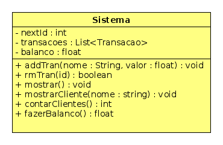

# Agiota gente Fina


Seu Plutolomeu é um agiota que empresta dinheiro a juros 0. Ele é uma pessoa muito carismática a amiga de todos. De sorriso largo sempre aberto, Plutolomeu é amigo da vizinhança. Inclusive esse ano, ele ganhou uma festa de aniversário surpresa de todos os seus devedores. Só quem é gente muito fina ganha festa surpresa né?

**Um, pelo menos foi isso que ele disse pra polícia quando foi pego em flagrante com 50 mil reais escondidos debaixo do colchão!**

Vamos abstrair um pouco da história de Plutolomeu e analisar o sistema de emprestimos que ele tinha instalado em seu computador.

---
Você deve construir um sistema para registrar entrada e saída de dinheiro. Cada movimentação deve ter um valor e nome de cliente. Você deve ser capaz de calcular quanto um cliente está devendo e o saldo da conta de Ptolomeu.

## Funcionalidades

- **[1.0 P]** Iniciar Sistema.
    - Inicia o sistema com uma certa quantidade de dinheiro.
    - Apaga todos os registros de transações que existam.

```
>> iniciar $valor
sistema iniciado com $valor
```

---
- **[1.0 P]** Adicionar transação.
    - Uma transação tem um nome de cliente e um valor numérico.
    - Um valor negativo indica que essa pessoa pegou um empréstimo de Ptolomeu.
    - Um valor positivo indica que ela deu o dinheiro para Ptolomeu, seja quitando uma dívida ou fazendo um investimento.
    - Cada transação deve receber do sistema um identificador numérico crescente.
    - A primeira transação tem id 0. A segundo tem id 1 e etc.
    - **[1.0 E]** Ptolomeu não pode emprestar dinheiro se não tiver dinheiro suficiente.

```
>> addTran $nome $valor
ok | transacao $id adicionada
erro | não há dinheiro suficiente para empréstimo.
```

---
- **[1.0 P]** Mostrar transações.
    - Mostre todas as transações

```
>> showTran
Lista de transações:
$id $nome $valor
$id $nome $valor
...
```

---
- **[1.0 P]** Remover uma transação.    
    - As vezes os clientes se arrependem e desistem após fazer as transações. Ptolomeu então precisa apagar a transação do histórico.
    - Dado o id, apague a transação correspondente.

```
>> rmTran $id
ok | transação removida
erro | transação não encontrada
```

---
- **[1.0 P]** Mostrar cliente.
    - Mostra todas as transações de um cliente.
    - Mostra o saldo do cliente no final

```
>> showCli $nome
Lista de transações de $nome:
$id $nome $valor
$id $nome $valor
...
Saldo: $saldo
```

---
- **[1.0 P]** Fazer balanço do sistema.
    - Soma todas as operações.

```
>> balanco
Balanco: $balanco
```

---
- **[2.0 E]** Contar clientes.
    - Conta quantos clientes diferentes existem no sistema.

```
>> contarCli
Existem $qtd clientes diferentes no sistema.
```

---
- **[1.0 P]** Inicialize o sistema com valores válidos.

## Dicas
- A variável nextId guarda o valor do próximo id de transação. Cada nova transação ela aumenta de 1.
- Você pode usar uma lista auxiliar com os nomes para contar a quantidade de clientes, mas só faça esse Extra depois de fazer todos os Pontos.
- Dentro da função addTran, crie uma transação utilizando o nextId, adicione-a na lista e depois incremente o nextId de 1.

## Diagrama
- Gets, Sets e toString omitidos.



## Fim da história

- Então assim ficou Ptolomeu, depois de conseguir explicar pra polícia que tudo não passou me um mal entendido. 
    - *Essa explicação custou 20.000 reais*, mas isso é detalhe, ninguém comenta.

