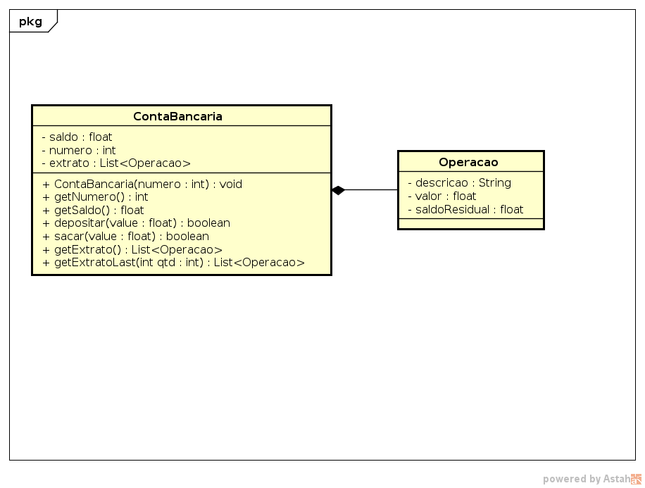

## Conta Bancária

O objetivo dessa atividade é implementar uma classe responsável por gerenciar a conta bancária de um único cliente. Faremos operações de saque, depósito e extrato.

Ela deve ser capaz de:
- [1P] Guardar o número da conta.

        >> iniciarConta _numero
        Conta iniciada
- [1P] Ver saldo.

        >> saldo
        Conta: _numero, Saldo: _valor
- [1P] Realizar operação de saque.
- [1E] Verifique se o valor é positivo e há saldo suficiente.

        >> saque _valor
        sacado _valor/saldo insuficiente
- [1P] Realizar operação de depósito.
- [1E] Verifique se o valor é positivo.

        >> deposito _valor
        deposito realizado
- [2P] Retornar o extrato das operações.
- A descrição pode ser "saque" ou "deposito".
- Os saques devem ter valor negativo e os depósitos positivos.
- [1P] Mostre o novo saldo resultado de cada operação no sistema na última coluna do extrato. 

        >> extrato
        descricao1 valor1 saldo1
        descricao2 valor2 saldo2
        ...
        descricaoN valorN saldoN

- [1E] Mostre apenas as última N operações do extrato.
- Se \_qtd for 3, por exemplo, mostre as 3 última operações do extrato.
        >> extratoN _qtd
        descricao valor1 saldo1
        descricao valor2 saldo2
        descricao valor3 saldo3

- [1P] Faça um código de inicialização para que seu sistema já inicie com algumas operações realizadas.

## Diagrama de Classes

O diagrama é uma **sugestão** de métodos e parâmetros. Sinta-se livre para alterar conforme sua necessidade.

