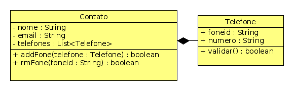

# Contato Telefônico

O objetivo dessa atividade é implementar uma classe responsável por guardar um **único** contato da agenda telefônica do seu celular. Cada contato pode ter vários telefones e email.

## Requisitos de contatos
Seu sistema deve poder:

- **[1P]** Iniciar contato com o nome. Se já havia contato, apague as informações.

        >> iniciar $nome
        contato criado

---
- **[1P]** Mudar o nome do contato.

        >> setNome $nome
        Nome atualizado

---
- **[1P]** Mudar o email do contato.

        >> setMail $mail
        email atualizado

---
- **[2P]** Inserir telefones no contato.
- Um telefone tem um foneid e uma descrição.
- Identificadores serão nomes como oi, tim, casa, trabalho.
- **[1E]** Não aceite dois telefones com o mesmo foneid.
- **[1E]** Verifique se o número contém apenas dígitos ou os caracteres "()-".

        >> addFone $foneid $number
        ok
        erro | $foneid duplicado
        erro | $number com caracteres invalidos

---
- **[1E]** Remover os telefones pelo $foneid

        >> rmFone $foneid
        fone removido
        fone nao encontrado

---
- **[1P]** Mostrar o contato(nome e email)
- **[1P]** Mostrar o contato(telefones)

        >> mostrar
        Nome: $nome, Email: $email
        $foneid $number 
        ...
        $foneid $number

---
- **[1P]** Inicie seu sistema com um contato iniciado e alguns telefones inseridos.

## Atividade

- Implemente a classe contato com as adaptações que julgar necessárias.
- Crie a interface com o usuário que permita interagir com a classe Contato.

## Diagrama UML
Métodos como gets, sets, show e toString() omitidos. Crie-os onde julgar necessários.

