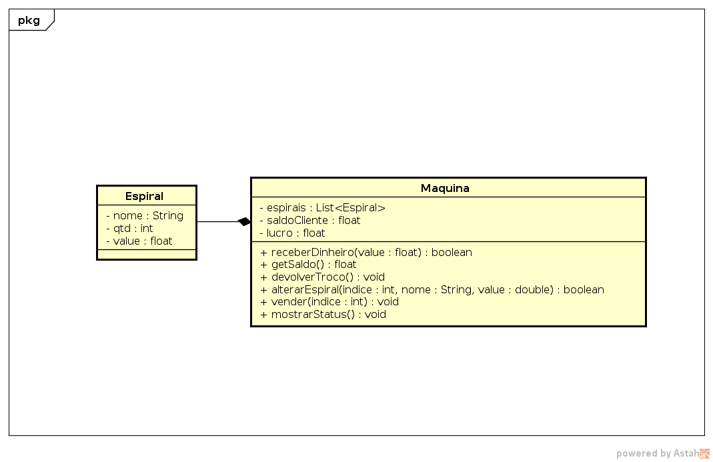

## Máquina de Vender JunkFood


O objetivo dessa atividade é implementar uma classe responsável por uma máquina de vender JunkFood. Na máquina existem várias espirais. Uma espiral contém uma certa quantidade de produtos com o mesmo tipo e mesmo preço. O usuário coloca o dinheiro, compra o produto e recebe o troco.

Ela deve ser capaz de:

* **[1P]** Receber dinheiro do usuário.

```
>> inserirDin $valor
sucesso/erro
```

---
* **[1P]** Mostrar o saldo da máquina

```
>> saldo
$saldo Reais
```

---
* **[1P]** Pedir troco, zerando o saldo da máquina

```
>> pedirTroco
voce retirou $valor Reais
```

---
* **[1P]** Iniciar a máquina definindo o número de espirais e a quantidade máxima de produtos em uma espiral.
* Se já havia máquina, então apague tudo e inicie uma nova máquina.

```
>> iniciar $qtdEspirais $maxProdutos
ok
```

---
* **[1P]** O admin pode alterar o nome, a quantidade e o valor de um produto na espiral.
* **[2E]** Cheque se índice, qtd e valor são válidos e nome não é vazio.

```
>> alterarEspiral $ind $nome $qtd $valor
ok
erro | indice invalido
erro | qtd maior que o permitido
```

---
* **[1P]** O cliente pode pedir um produto de um espiral.
* **[1E]** Verifique se existe o produto e se o valor é suficiente.
* Mostre o nome do produto que ele pediu.

```
>> comprar $ind
ok | você comprou um $nome
erro | produto nao existe
erro | valor insuficiente
```

---
* **[1P]** O admin pode mostrar o status completo da maquina
    * saldo cliente.
    * lucro total.
    * conteúdo de cada espiral.

```
>> status
saldo: $saldo
lucro: $lucro
ind 0: nome: $nome, qtd: $qtd, valor: $value
ind 1: nome: $nome, qtd: $qtd, valor: $value
...
```

---
* **[1P]** Faça um código de inicialização para o sistema já iniciar com alguns produtos nas espirais.


## Dica

- Faça primeiro a classe Espiral. Garanta que existe um construtor default seja sem parâmetros ou com todos os parametros com valores default.
- No contrutor da class Maquina receba a quantidade de espirais. Para iniciar o vetor de espirais você pode fazer um laço inserindo qtd Espirais no vetor.
- Exemplo c++

```c++
//c++
struct Espiral{
    string nome;
    int qtd;
    float value;
    Espiral(int qtd = 0, string nome = "", float value = 0.0f){
        ...
    }
};

class Maquina{
    vector<Espiral> espirais;

    //modo feio que funciona
    Maquina(int qtd){
        for(int i = 0; i < qtd; i++)
            espirais.push_back(Espiral());
    }

    //modo charmoso usando lista de inicialização
    Maquina(int qtd):
        espirais(qtd);
    {}

}
```

- Exemplo Python

```python
class Espiral:
    def __init__(self, qtd = 0, nome = "", value = 0.0):
        self.qtd = qtd
        self.nome = nome
        self.value = value


class Maquina:
    #modo bruto, mas que funciona
    def __init__(self, qtd):
        self.espirais = []
        for i in range(qtd):
            self.espirais.append(Espiral())

    #modo charmoso usando list-comprehension
    def __init__(self, qtd):
        self.espirais = [Espiral() for i in range(qtd)]
```


## Diagrama

