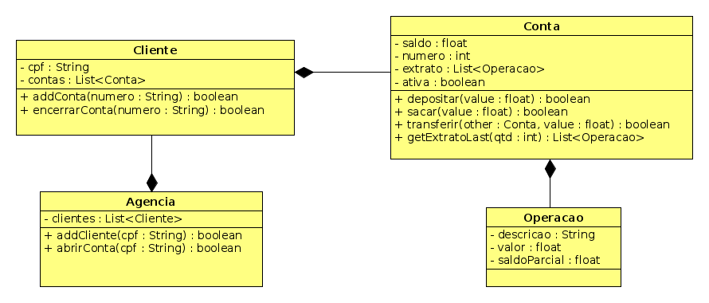

## Agencia Bancária


O objetivo dessa atividade é implementar uma agência bancária simplificada. Deve ser capaz de cadastrar cliente. Cada cliente pode ter várias contas. Uma conta não pode existir se não estiver viculada a um cliente.

Expanda a atividade nível 1 Conta Bancária e adicione os novos requisitos.

## Funcionalidades

### Ações Administrativas

- **[1.0 P]** Cadastrar um cliente com cpf.
    - CPFs devem ser únicos no sistema.

```
>> addCli $cpf
Cliente adicionado
------
erro | cpf duplicado
```

---
- **[1.0 P]** Abrir contas para clientes.
    - Cada conta deve receber do sistema um número único no sistema.
    - Quando o cliente é cadastrado no sistema, automaticamente é aberta uma conta
  para ele.
    - **[1.0 E]** Cada cliente pode ter até 2 contas ativas.

```
>> abrirConta $cpf
conta $conta aberta
------
erro | cpf não existe
erro | limite de contas atingido
```

---
- **[1.0 E]** Encerrar contas de clientes
    - Contas encerradas não podem mais realizar nenhuma operação. Elas não são apagadas. Apenas desabilitadas.
    - Contas só podem ser desabilitadas se tiverem com saldo zerado.

```
>> encerrarConta $conta
ok   | conta $conta encerrada
------
erro | conta invalida
erro | conta ja esta encerrada
erro | saldo positivo
```

---

### Ações de Clientes

- **[1.0 P]** Mostrar os clientes e suas contas ativas.
    - **[1.0 E]** Mostre ordenado por nome do cliente.

```
>> showAllCli
1 - $cpf [$conta1 ...]
2 - $cpf [$conta1 $conta2 ...]
...
```

---
- **[1.0 P]** Fazer login e logout no sistema.
    - Um único cliente pode estar logado de cada vez.
- Login:

```
>> login $cpf
ok
------
erro | cpf invalido
```

- Logout:

```
>> logout
ok
------
erro | nenhum cliente logado
```

---
- **[1.0 P]** Mostrar dados do cliente, suas contas e saldos.
    - Cliente precisa estar logado.
    - Se não tiver implementado encerrar conta, não mostre o status(ativa/inativa).

```
>> show
Cliente: $cpf
Conta: $conta1, Saldo: $saldo1, Status: $ativa1
Conta: $conta2, Saldo: $saldo2, Status: $ativa2
...
Saldo total: $value
------
erro | cliente não logado
```

---
- **[1.0 P]** Realizar operações de saldo, saque, depósito e extrato, tal como foi
implementado no primeiro trabalho.
     - Cliente só pode fazer operações em suas próprias contas.
     - Cliente precisa estar logado.

```
>> saldo $conta
>> saque $conta $valor
>> deposito $conta $valor
>> extrato $conta
>> extratoN $conta $qtd
```

---
- **[1.0 P]** Realizar operações de transferência entre contas.
    - No extrato essa ação deve vir com descrição "transferência para/de $conta".
    - Verifique se há saldo para efetuar a transação.
    - Cliente precisa estar logado e possuir a conta de débito.

```
>> transf $contaDe $contaPara
ok   | efetuado
------
erro | numero conta $conta invalido
erro | saldo insuficiente
erro | cliente nao logado
```

---
- **[1.0 P]** Faça um código de inicialização para que seu sistema já inicie com
alguns clientes, contas e operações realizadas.

## Resumo de Pontos

```
[ ][1.0 P] cadastrar cliente
[ ][1.0 P] abrir conta cliente
[ ][1.0 P] mostrar todos os clientes
[ ][1.0 P] cadastrar cliente
[ ][1.0 P] login
[ ][1.0 P] logout
[ ][1.0 P] mostrar contas de um cliente
[ ][1.0 P] saldo, saque, deposito, extrato

[ ][1.0 E] limitar contas ativas
[ ][1.0 E] encerrar contas
[ ][1.0 P] mostrar clientes ordenados
```

## Diagrama de Classes

O diagrama é uma **sugestão** de métodos e parâmetros. Sinta-se livre para alterar conforme sua necessidade. Os métodos gets e sets são omitidos em diagramas de classes.


