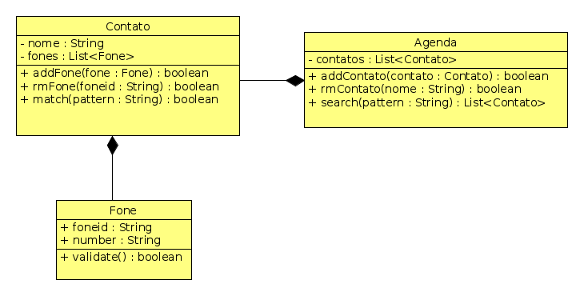

## Agenda telefônica


Ampliando a atividade de contatos do nível 1, vamos criar uma agenda que gerencia os nossos contatos.

## Requisitos de Contatos

**Antigos**:

* Todo contato deve ter um nome e opcionalmente um email.
* O nome do contato não pode ser vazio.
* [1P] Deve ser possível alterar o nome e o email.
```
>> setNome _nome
Nome atualizado

>> setMail _mail
email atualizado
```
* O contato pode ter vários telefones.
* Telefones não devem ser vazios.
* [1P] Não deve ser possível inserir dois números de telefones iguais.
* [1E] Um email deve seguir o modelo a@b.c, contendo arroba e ponto nessa ordem.
* [1E] Um telefone deve ser composto apenas por digitos.

## Requisitos da Agenda

* [2P] Possuir vários contatos.
* [4P] Deve ser possível inserir, remover, alterar e buscar contatos.

```
>>>> addContato _nome _email
Contato adicionado

>> rmContato _nome
Contato removido

>> alterarContato _nome _novoNome _novoemail
Contato alterado

>> listarContato
Nome: _nome, Email: _email
Fone1 Desc1
...
FoneN DescN
```

* [1P] Deve ser possível buscar contatos por padrão(substring).
Dado um padrão, o sistema deve retornar todos os contatos que contém esse padrão como parte dos seus campos

```
>> buscar _substring
[contato1 contato2 ...]
```
* [1P] Não deve ser permitido dois contatos com o mesmo nome.

## Atividade
- Adapte sua antiga classe Contato se achar necessário.
- Implemente a classe Agenda.
- Faça uma processo de inicialização da Agenda em código para ao abrir
o programa, já estarem cadastrados alguns contatos.
- Crie a interface que permita ao usuário interagir com a Agenda.

## Diagrama de Classes

- Métodos Get e Set de atributos básicos omitidos.


