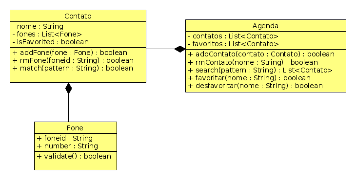

## Agenda telefônica

Ampliando a atividade de contatos do nível 1, vamos criar uma agenda que gerencia os nossos contatos.

## Funcionalidades

O sistema deverá:

- **[1.0 P]** Adicionar contatos usando um nome.
        - Não deve ser possível adicionar dois contatos com o mesmo nome.

        >> addContato $nome
        contato adicionado
        ------
        erro | contato já existe

---
- **[1.0 P]** Remover um contatos pelo nome.

        >> rmContato $nome
        contato removido
        ------
        erro | contato não existe

---
- **[1.0 P]** Adicionar telefones ao contato.
        - Telefones tem identificador e número.
        - Identificadores serão strings como (casa | fixo | oi | tim | recado).
        - Não deve ser possível adicionar dois telefones com o mesmo identificador no mesmo contato.
        - O número deverá conter apenas dígitos.

        >> addFone $nome $foneid $number 
        ok
        ------
        erro | foneid já existe
        erro | numero inválido
        erro | nome não existe

---
- **[1.0 P]** Remover telefones do contato pelo foneid.

        >> rmFone $nome $foneid
        ok
        ------
        erro | $nome nao existe
        erro | $foneid não existe

---
- **[1.0 P]** Mostrar todos os contatos.
                - **[1.0 E]** Ordenar os contatos pelo nome.
        - Marque os contatos que são favoritados com um @ antes do nome. Se o contato não for favorito use - antes do nome.

        >> showContatos
        - $nome1 [$foneid $number][$foneid $number]
        @ $nome2 [$foneid $number][$foneid $number] ...
        

---
- **[2.0 P]** Buscar contatos por substring.
        - Se o contato tiver qualquer campo que combine com a string pattern de busca, ele deve ser retornado.

        >> search $pattern
        - $nome1 [$fone1 $desc1][$fone2 $desc2] ...
        ...

---
- **[0.5 E]** Favoritar contatos.

        >> fav $nome
        ok
        erro | $nome não encotrado

- **[0.5 E]** Desfavoritar contatos.

        >> desfav $nome
        ok
        erro | $nome não encontrado
        erro | $nome não é favorito

---
- **[1.0 E]** Mostrar favoritos.

        >> showFav
        @ $nome1 [$fone1 $desc1][$fone2 $desc2] ...
        ...

---
- **[1.0 P]** Inicialize o sistema para que ele já inicie com alguns contatos e telefones.

---
## Resumo dos pontos

        [ ][1.0 P] addContato
        [ ][1.0 P] rmContato
        [ ][1.0 P] addFone
        [ ][1.0 P] rmFone
        [ ][1.0 P] mostrar Contatos
        [ ][2.0 P] busca por padrão
        [ ][1.0 P] inicialização do sistema
        [ ]     Total pontos

        [ ][0.5 E] favoritar
        [ ][0.5 E] desfavoritar
        [ ][1.0 E] mostrar favoritos
        [ ][1.0 E] mostrar contatos ordenados
        [ ]        Total Extras

## Sugestões
- Na busca por padrão, faça a agenda perguntar para cada contato se ele bate com o padrão.
- Crie métodos toString para todas as Classes.
- Crie um método match para o contato que faz a busca sobre o resultado do método toString de Contato.
- Quando remover um contato, verifique de removê-lo dos favoritos também.

## Diagrama de Classes

- Métodos Get, Set e toString omitidos.

