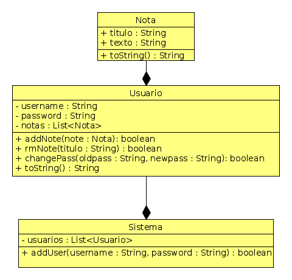

# Serviço de Anotações

O objetivo dessa atividade é criar um pequeno serviço de anotações. O sistema
terá vários usuários que vão logar utilizando login e senha. Cada usuário pode
armazenar notas de texto contendo título e texto.

# Funcionalidades

- **[1.0 P]** Criar usuário passando username e password.
- usernames devem ser únicos no sistema.

      >> addUser $username $password
      ok | usuario criado
      erro | username já existe

---

- **[1P]** Mostrar os usuários do sistema.

      >> showUsers
      $username1
      $username2
      ...

----

- **[2P]** login/logout na conta de um usuário

      >> login $username $senha
      ok
      erro | username não existe
      erro | senha inválida

      >> logout
      ok
      erro | nenhum usuário logado

---
- **[1P]** Mudar password

      >> changePass $oldpass $newpass
      ok
      erro | password errado
      erro | ninguém logado

---
- **[1P]** Adicionar uma nota com título e texto.
- **[2E]** Título deve ter uma palavra, mas o texto pode conter várias palavras.

      >> addNote $titulo $texto
      ok
      erro | ninguem logado

---
- **[1E]** Apagar uma nota dado o título.

      >> rmNote $titulo
      ok
      erro | nota não encontrada
      erro | ninguém logado

---
- **[1P]** Mostrar notas

      >> showNotes
      $titulo1 $texto1
      $titulo2 $texto2
      ...

---
- **[1P]** Inicialize seu sistema com alguns usuários e algumas notas.

# Diagrama

