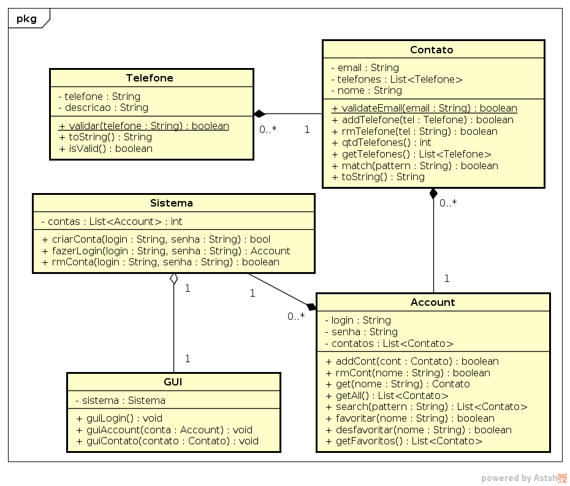

# Sistema de Contatos


Ampliando o a atividade de agenda do level 2, vamos criar um sistem que gerencia múltiplos
usuários.

Os requisitos são os seguintes.

---

## Funcionalidades

 **[2P]** Parte 01

* Uma agenda possui vários Contatos.
* Deve ser possível inserir, remover, alterar e buscar contatos.

- *[0.5P]* Inserir contato.
  *restrições*:
  - Todo contato deve ter um nome e opcionalmente um email.
  - O nome do contato não pode ser vazio.
  - Não deve ser permitido dois contatos com o mesmo nome.
  - Um email deve seguir o modelo a@b.c, contendo arroba e ponto nessa ordem.

  ```
  >> inserirContato $contato
  Contato adicionado
  ------
  Erro | Nome do contato não pode ser vazio.
  Erro | Não é permitido dois contatos com o mesmo nome.
  Erro | O email deve obedecer o padrão "a@b.c".
  ```

- *[0.5P]* Remover contato.
  *restrições*:
  - Remover contato a partir de um nome.
  ```
  >> removerContato $nome
  Contato removido || Contato inexistente
  ```
- *[0.5P]* Alterar Contato  
  *restrições*
  - Deve ser possível alterar o nome e o email.
- *[0.5P]* Buscar contato
  - Deve ser possível buscar contato a partir de um nome.
  ```
  >> buscarContato $contato
  $contato || Contato inexistente
  ```
---

**[2P]** Parte 02

- *[0.5P]* Inserir telefone.
  *restrições*:
  - Telefones não devem ser vazios.
  - Não deve ser possível inserir dois números de telefones iguais.
  - Um telefone deve ser composto apenas por digitos.
  - Cada telefone pode ter uma descrição. Ex: Oi, Tim, Fixo, Trabalho.
  ```
  >> inserirTelefone $telefone
  Telefone adicionado
  ------
  Erro | Telefone não pode ser vazio.
  Erro | Não é permitido dois telefones repetidos.
  Erro | O telefone deve ser composto apenas por digitos.
  ```
- *[0.5P]* Remover telefone.
  *restrições*:
  - Remover telefone a partir do numero.
  ```
  >> removerContato $numero
  Telefone removido || Telefone inexistente
  ```
- *[0.5P]* Retornar todos os telefone de um contato.
- *[0.5P]* Retornar quantidade de telefones de um contato.  

---

**[6P]** Parte 03

- *[1.5P]* Deve ser possível buscar contatos por padrão(substring). Dado um padrão, o sistema deve retornar todos os contatos que contém esse padrão como parte dos seus campos.
- *[1.5P]* Deve ser possível favoritar, desfavoritar contatos e pegar favoritos.
- Sempre que mostrar os contatos, seja em busca ou favoritos, estes devem ser apresentados ordenados alfabeticamente pelo nome.
- *[1P]* Deve ser possível criar contas fornecendo login e senha.
- *[1P]* Não devem existir dois usuários com o mesmo login no sistema.

---

**[1P]** Parte 04

- Implemente a class Sistema.
- Faça uma processo de inicialização do Sistema em código para ao abrir o programa, já estarem cadastrados alguns logins e contatos.
- Faça a interação com o usuário para utilizar o Sistema.

---

**[1E]**

Para interação com o usuário tente criar uma classe que fará apenas isso. Como sugestão, crie uma classe GUI que gerencia o Sistema em uma relação de Agregação.

---

## Diagrama de Classes

- Métodos Get e Set de atributos básicos omitidos.


