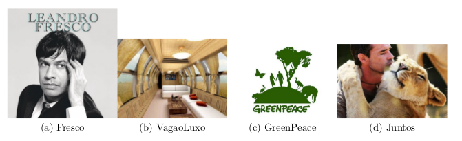

## Trem greenpeace

Nesse terceiro volume do Trem serão apresentadas várias pequenas modificações no volume dois. Você criará uma pessoa Fresca que não fica em vagões próximos de animais e até tem um vagão preferencial pra ela. Você implementará um tipo de pessoa que gosta de andar nos vagões com os animais caso seja possı́vel. Nesta atividade você conseguirá organizar e modularizar refatorando seu código parte a parte. 

Ao final dessa atividade você vai encontrar o controlador, os diagrama de classes e a saı́da esperada da junção de todas as seções. Não tente fazer tudo ao mesmo tempo. A cada nova seção tente fazer seu código funcionar.

>> addVagao $lugares

>> embarcar $nome

>> show
[lucas - - - ][- - -][- -]

>> desembarque $nome

-----
>> addVPessoa $lugares
>> addVCarga $limitePeso
>> addVFresco $lugares

>> embarcarPessoa $nome
>> embarcarGreen $nome $peso
>> embarcarFresco $nome

Cada embarque representa uma venda de passagem. Mostre as vendas na ordem que ocorreram.
>> mostrarVendas
	1 $tipo $nome
	2 $tipo $nome
	3 $tipo $nome

ok/lotado
>> embarcarAnimal $nome $peso
ok/lotado
>> desembarcar $nome
>> show
(_ _ _ _)[_20](- - andre) {- - -}