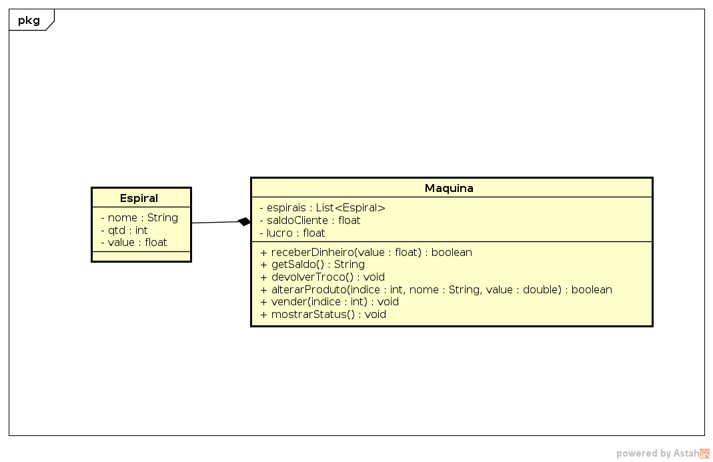

## Máquina de Vender JunkFood


O objetivo dessa atividade é implementar uma classe responsável por uma máquina de vender JunkFood. Na máquina existem várias espirais. Uma espiral contém uma certa quantidade de produtos com o mesmo tipo e mesmo preço. O usuário coloca o dinheiro, compra o produto e recebe o troco.

Ela deve ser capaz de:

* [1 PB] Receber dinheiro do usuário.

```
>> inserirDin _valor
sucesso/erro
```

* [1 PB] Mostrar o saldo da máquina

```
>> saldo
_saldo Reais
```
* [1 PB] Pedir troco, zerando o saldo da máquina

```
>> pedirTroco
voce retirou _valor Reais
```
* [1 PB] Iniciar a máquina definindo o número de espirais.
* Se já havia máquina, então apague tudo e inicie uma nova máquina. 

```
>> iniciar _qtd
ok
```
* [1 PB] O admin pode alterar o nome, a quantidade e o valor de um produto na espiral.
* [2 PP] Cheque se índice, qtd e valor são válidos e nome não é vazio.

```
>> alterarProd _ind _nome _qtd _valor
ok/erro
```
* [2 PB] O cliente pode pedir um produto de um espiral. 
* [1 PP] Verifique se existe o produto e se o valor é suficiente.
* Mostre o nome do produto que ele pediu.

```
>> comprar _ind
ok/erro(produto nao existe)/erro(valor insuficiente)
Voce comprou um _nome
```

* [1 PB] O admin pode mostrar o status completo da maquina 
    * saldo cliente.
    * lucro total.
    * conteúdo de cada espiral.

```
>> status
saldo: _saldo
lucro: _lucro
ind 0: nome: _nome, qtd: _qtd, valor: _value
ind 1: nome: _nome, qtd: _qtd, valor: _value
...
```

## Diagrama


